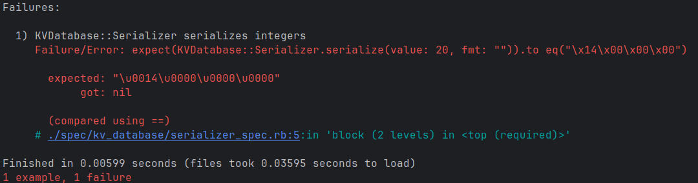
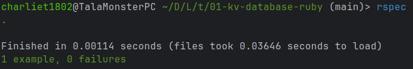

# Thought process 1 (pair programming if you're reading this)

This process starts after understanding how a KV (Key-Value) database can be implemented inspired by the great explanation found [here](https://dineshgowda.com/posts/build-your-own-persistent-kv-store/). I also invite you to read the first part of this series in my blog, which you can find [here](https://charlie2code.com/blog/building-a-key-value-database-in-ruby-using-tdd/part-01).

I'll mix tenses because thinking is a weird process, isn't it? And I'll honestly just write what I think, without filters. Since the purpose of this is for the reader to "get into my head", I'll talk about "I" most of the time, so you can feel that you're in my shoes. I added the titles for each section after finishing all the work, because, how else would I know what I was going to talk about?

## What I know (or what I believe I know)

I know two things:

1. I need to have something to convert the data to binary and from binary
2. I need to have something to write new data to files and get data from files

I could just mix everything if I go really slowly, but up to this point I know that converting stuff is different from writing to files and reading from files, so I know that these two things should "live" in different spaces. Since I can do OOP (Object-Oriented Programming) in Ruby, these two different things/spaces are actually classes.

The one for dealing with binary data could be a "Converter", but a fancier term is "Serializer" (and one that might be more precise for people with a technical background), since there's actually a format and some rules that I can impose to serialize and deserialize binary data. The one for writing data to files and reading from them could be a "database file reader", but that talks a lot about what's going on inside, and what I want is to express the intent of the class, not what it does. Since this class is for writing and reading, and when I write something it ends up in a place where I can read from later, that information is stored somewhere. If this database implemented different ways of storing data, one could be "CloudStore", another one could be "DiskStore" and so on. "DiskStore" is what I'll actually be doing, storing stuff in files in my local disk, so I like that name better.

Because I'm an organized person, I'll create a module `KVDatabase` that will contain another module `Serializer` and a class `DiskStore`. Why not make `Serializer` a class? Because I don't want instances of `Serializer`, I just want to use these functions as helpers.

```rb
# src/kv_database/serializer.rb
# frozen_string_literal: true
module KVDatabase
  module Serializer
    # Methods here (serializer is not a class by definition
    # but the way we'll use it will be class-like,
    # that's why I call them "methods" so, yeah)
  end
end
```

```rb
# src/kv_database/disk_store.rb
# frozen_string_literal: true
module KVDatabase
  class DiskStore
    # Methods here (now they are "real" methods)
  end
end
```

Now, I need to be able to serialize binary data to store it in the first place, so I first need `Serializer` done and then I can start thinking about `DiskStore`. So I'll focus on `Serializer` first.

## Serializer

I know this class has to do two things:

1. Serialize data
2. Deserialize data

I cannot know how to invert a process without knowing what that process does, so I cannot deserialize without knowing how to serialize. So I'll focus on serializing first.

### Serializing integers

Remembering (or reminding or recalling, whatever) that TDD is not about implementations, but about making tests pass, I need to focus on what tests, related to serializing data, I can create. For now, the easiest that comes to my mind is just checking that an integer like 20 can be converted to an array of binary data. After packing the data, the result in hexadecimal, using a 32-bit representation, hence 4 bytes, would be `0x00000014`, because decimal 20 is 14 in hexadecimal. In little endian representation, we basically start from the least significant byte (the rightmost one), to order the bytes, so in other words, just reverse it: `0x14000000`.

That's how it would be stored in memory, `14 00 00 00`. In the programming languages realm, this wouldn't be represented as an array, it would be represented as a binary string. `"0x14000000"` is what I would see, except that it's not, because each byte needs to be delimited (that's what the `"x"` does). So what I'm actually going to see is `"\x14\x00\x00\x00"`, using a `"\"` to escape the `"x"` character. This means, a first test could just test that 20 is packed as `"\x14\x00\x00\x00"`.

I know that a `serialize` function will take a value to be serialized and the format, because later I need to know how was that data serialized, so I can know how to deserialize it. So it'll look like this:

```rb
# src/kv_database/serializer.rb
def self.serialize(value:, fmt:); end
```

I use keyword parameters because I don't want to mess up with the order and they make my code clearer. I'll write my first test and see it fail (the setup and all that stuff is in `spec/spec_helper.rb` which you can get using `rspec --init` in the command line):

```rb
# spec/kv_database/serializer_spec.rb
# frozen_string_literal: true

RSpec.describe KVDatabase::Serializer do
  it "serializes integers" do
    expect(KVDatabase::Serializer.serialize(value: 20, fmt: "")).to eq("\x14\x00\x00\x00")
  end
end
```



I don't know what formats I need, so I'll leave it empty. The name for the test could be better, but I don't know where I'm heading to, so it's okay for now. To make the test pass, I'll just make a fake implementation by returning exactly that we expect.

```rb
def self.serialize(value:, fmt:)
  return "\x14\x00\x00\x00"
end
```



The test passes and we all are happy (this is what I will always feel when seeing that green color, but I'll just mention it once).

(If it's not clear enough by now, don't care about repeating stuff, magic strings and so, that doesn't matter now, that's what refactoring is for).

Right now I could just place `"\x14\x00\x00\x00"` in a constant, but that would only make sense for the test, not for the fake implementation because it won't be fake as I move on. So I'll refactor the test, actually.

```rb
it "serializes integers" do
    expected = "\x14\x00\x00\x00"
    expect(KVDatabase::Serializer.serialize(value: 20, fmt: "")).to eq(expected)
  end
```

I could also move the value and `serialize` method call to an auxiliary variable, but the test is so simple that that would just add unnecessary complexity. Now I will create the actual implementation for this. Turns out that Ruby provides a method called `pack` precisely to pack some array of values into a binary representation (an array of bytes). If we have only one value (20), then we will just put the value inside an array to have a single-value array to pack. The syntax is this:

```rb
n = [ 65, 66, 67 ]
n.pack("ccc") # "ABC"
```

The method is available for any array, and then it takes a string with some weird stuff. That weird stuff are actually formats. Each `"c"` represents `"character"` (ASCII), so it tells `pack` to convert the first, second and third value of `n`, into `c`, `c`, and `c`, respectively. This will result in an array of bytes where each byte represents an ASCII character. In this case, `65 -> A`, `66 -> B`, `67 -> C`. In the memory, the array of bytes will be stored, but Ruby will handle the conversion when printing this out, that's why we won't see an array of bytes, and we will see the characters instead.

Going back to the little endian representation, to ensure it works like that, a `"<"` symbol is needed after each format letter that doesn't follow this representation by default. First, I need to change the test:

```rb
it "serializes integers" do
  expected = "\x14\x00\x00\x00"
  expect(KVDatabase::Serializer.serialize(value: 20, fmt: "L<")).to eq(expected)
end
```

For now, it really doesn't matter what format is used in here as long as it's for an integer of at least 32 bits to avoid any unexpected behavior. In this case, `L` is for `unsigned long`, which is 32 bits. Using a shorter format, like 16 bits, would make the test fail because the result would be 2 bytes, which would be `"\x14\x00"` instead of the expected. This test seems brittle, but I'm not sure. Later on, as I introduce more tests, I'll determine what tests are actually reliable and useful.

Now I have to modify the implementation of `serialize` to use the `pack` method with the provided format.

```rb
def self.serialize(value:, fmt:)
  return [value].pack(fmt)
end
```

Right now the function looks like a simple wrapper, and it is, but again, it's okay. It's a little interface to encapsulate behavior. The fact that it doesn't do too much right now, doesn't mean that it isn't important. I can safely assume that `value` won't be an array already, and if it is, blame the person who didn't provide docs or signatures for that parameter... oh, wait, that was me. I could add some guard to "fix" this behavior, but for now I don't worry about it given that this method will change, because right now it assumes only integers are passed. After changing the implementation of `serialize`, the test will keep passing (it's honestly a pain to manage images, so I'll just put them for cases where they introduce new information, otherwise this would be full of test-failing-and-test-passing screenshots).

So far a simple version of `serialize` is ready, so I'll move onto the `deserialize` method. For this, I will create a new test that does the same, but the other way around.

### Deserializing integers

```rb
it "deserializes integers" do
  expected = 20
  expect(KVDatabase::Serializer.deserialize(value: "\x14\x00\x00\x00", fmt: "L<")).to eq(expected)
end
```

Of course this will fail because `deserialize` doesn't even exist. I will implement it using a fake implementation just to make the test pass:

```rb
def self.deserialize(value:, fmt:)
  return 20
end
```

It passes. Now things get interesting (as if they weren't already), how to deserialize data? Well, again, turns out that strings have a method called `"unpack1"` that, given a format, return a single interpreted value, instead of an array of them. This is useful because I know that I'm storing a single integer, so I can safely assume that unpacking it by extracting a single value will give me the actual integer. Therefore, I will change the implementation to use `unpack1`:

```rb
def self.deserialize(value:, fmt:)
  return value.unpack1(fmt)
end
```

The test passes (nice, I didn't break anything, that's the great part about having tests).

So far I have implemented `serialize` and `deserialize` for integers just by trying to make the tests pass. The next step is making this work for any type of data. What other data types do I care about? All of them? Well, no. An integer can represent virtually everything, at the end that's how data is represented in memory, but in real-world terms, an integer doesn't have the precision of a float, for example. For strings, let's remember that these two functions are being implemented to deal with binary data. How strings work? Using ASCII characters, each character fits into 1 byte, but ASCII doesn't include characters outside the English language. For this, Unicode was invented. In Unicode, each character is stored using 4 bytes, because any special character fits into 4 bytes. UTF-8 is the standard for this encoding process. Encoding a string using UTF-8 will explicitly convert it into binary data, although the encoding doesn't play a role in how data is stored (more about this in the part 3).

For other data types, they are already covered. Booleans can be represented with 0 or 1, `nil` could be a string. Maps, arrays, objects and all those fancy data structures, can be stringified when stored and then parsed when retrieved.

### Serializing floats

I will start with float numbers. They're harder to understand because of how floating-point numbers are stored in memory, but I just need to know what to expect, I'm not going to convert a float number to a hexadecimal representation just for fun. First thing to do? To surprise of no one (I expect), a test. However, this test is a bit more complicated. To maximize precision, float numbers will be stored using the precision of a `double`. That means 64 bits with up to 17 digits of decimal precision. 64 bits is 8 bytes, so the expected value needs to be a binary string with 8 sets of 2 digits each, each being 1 byte. The format assigned to this double precision is just `"E"`.

```rb
it "serializes floats" do
  expected = "\x8f\xc2\xf5\x28\x5c\x8f\x2c\x40".b
  expect(KVDatabase::Serializer.serialize(value: 14.28, fmt: "E")).to eq(expected)
end
```

The only thing that looks weird is having to use `.b` in the expected value. This is needed because strings in Ruby are UTF-8 by default (yeah, yeah, "they are encoded in", **keep it simple**). but the result of `serialize`, using `pack` under the hood, is encoded in ASCII. That `.b` encodes the string in that format.

This test will pass because float numbers are converted into binary strings the same way integers are, so just changing the format is enough.

### Deserializing floats

Now I will create the test for deserializing floats:

```rb
it "deserializes floats" do
  expected = 14.28
  expect(KVDatabase::Serializer.deserialize(value: "\x8f\xc2\xf5\x28\x5c\x8f\x2c\x40", fmt: "E")).to eq(expected)
end
```

It will pass as well because of the same reason mentioned above.

### Serializing strings

Now let's move onto the strings. Things are different with them because for serializing them, the process is actually encoding them into UTF-8, not using `pack`. Again, a new test:

```rb
it "serializes strings" do
  expected = "\x63\x61\x66\xc3\xa9"
  expect(KVDatabase::Serializer.serialize(value: "café", fmt: "")).to eq(expected)
end
```

It's important to use special characters so this test is reliable. Otherwise it wouldn't be testing for all the possible cases of a string. The test will fail because `["café"].pack("")` will do nothing. So, how to solve it? Well, the obvious implementation would be: since this works different for strings, I can just check that if the value is a string, it encodes it as UTF-8 instead of trying to pack it using a format.

```rb
def self.serialize(value:, fmt:)
  if value.is_a?(String)
    return value.encode(Encoding::UTF_8)
  end

  return [value].pack(fmt)
end
```

Now the test will pass. Because, let's remember that encoding something in UTF-8 is just packing it into some specific order and distribution of bytes inside an array.

### Deserializing strings

Now let's create the test for deserializing:

```rb
it "deserializes strings" do
  expected = "café"
  expect(KVDatabase::Serializer.deserialize(value: "\x63\x61\x66\xc3\xa9", fmt: "")).to eq(expected)
end
```

Given that there's no format because this wasn't converted into binary data using a format and `pack`, this test will fail. The interesting part is that the implementation is obvious here, but cannot be achieved with the current function.

The obvious implementation is that for strings, there's nothing special to do, just return the data itself. Why? Because the data is stored as an array of bytes following the UTF-8 standard, and strings are by default UTF-8 in Ruby (and I guess in most languages), so the only thing that is happening is that I explicitly encoded the string in this format, so Ruby is just seeing the same data that it always has to deal with when it comes to strings, the only difference is that now I did the extra work.

And now, why cannot it be achieved with the current function? Because the value is always a binary string, so there's no way to tell if it's an integer or a float. So this tells me that the way I structured the functions is wrong. `serialize` is wrong because it's not using `fmt` for strings, and `deserialize` is wrong because it doesn't allow me to deserialize strings. To solve this, I can see that the key here is the type of the value. If the format is not needed for strings, and deserializing implies having the ability to tell if the value is integer, float or string, then a new parameter for the type is needed. Let's start with `serialize`. Things will get ugly because all the tests will break. I will comment the new test for deserializing strings so I it doesn't confuse me when the other tests fail.

### Fixing the `serialize` method

Now I will change the implementation of `serialize` to include the `type` param. The type should not be a simple string, because that would be messy. Apparently I could use the exact types, like `Integer`, `Float` and `String`, but that feels weird, perhaps it's perfectly valid, but I don't feel comfortable with that approach now. I could implement some hash map but I would still need a way to avoid errors when accessing it through the keys using strings. Coming from a JS background, I remember that there's a special data type that can be used when you need a unique and immutable value during the execution of the program. That type is a `symbol`. Symbols are by definition unique. In Ruby they can be defined just as `:{symbol_name}`, so they're safe to be used for comparisons. Besides, now that I see, the keys of a map (dictionary, whatever), are by default symbols, so if I wanted to create a hash map for types, using the exact types would be weird, and it's more idiomatic to use symbols.

These symbols can be just named like the types, but being symbols. So the new implementation of `serialize` would be:

```rb
def self.serialize(value:, fmt:, type:)
  if type == :String
    return value.encode(Encoding::UTF_8)
  end

  return [value].pack(fmt)
end
```

Yeah, I'm introducing `type` and at the same time changing how the string type check is performed. Advisable? Barely. But this is concise enough not to make a mess and create confusion while developing this thing. I just like to think in a pragmatic way and when it happens, I can just skip the "rule" because I found the exception to it. This will, of course, break the tests because `type` is not being passed. Now let's fix the tests:

```rb
it "serializes integers" do
  expected = "\x14\x00\x00\x00"
  expect(KVDatabase::Serializer.serialize(value: 20, fmt: "L<", type: :Integer)).to eq(expected)
end

it "serializes floats" do
  expected = "\x8f\xc2\xf5\x28\x5c\x8f\x2c\x40".b
  expect(KVDatabase::Serializer.serialize(value: 14.28, fmt: "E", type: :Float)).to eq(expected)
end

it "serializes strings" do
  expected = "\x63\x61\x66\xc3\xa9"
  expect(KVDatabase::Serializer.serialize(value: "café", fmt: "", type: :String)).to eq(expected)
end
```

And now they all pass again. One more thing that seems like a `code smell` is that `fmt` is not needed for strings, so useless information is being passed for that case, but I'll go back to this after making the test for deserializing strings pass.

### Adjusting `deserialize` for strings

Let's first add `type` to `deserialize` and just return the value when it's a string.

```rb
def self.deserialize(value:, fmt:, type:)
  if type == :String
    return value
  end

  return value.unpack1(fmt)
end
```

### Fixing tests for deserializing

Again, this could be done by adding the type and later on adding the conditional to check for the string type, but it's manageable to take two steps here, so it's okay. Now let's fix the tests for integers and floats:

```rb
it "deserializes integers" do
  expected = 20
  expect(KVDatabase::Serializer.deserialize(value: "\x14\x00\x00\x00", fmt: "L<", type: :Integer)).to eq(expected)
end

it "deserializes floats" do
  expected = 14.28
  expect(KVDatabase::Serializer.deserialize(value: "\x8f\xc2\xf5\x28\x5c\x8f\x2c\x40", fmt: "E", type: :Float)).to eq(expected)
end
```

They will pass.

### Deserializing strings (now for real)

Let's uncomment the test that started all these changes and pass the `:String` type to `deserialize`:

```rb
it "deserializes strings" do
  expected = "café"
  expect(KVDatabase::Serializer.deserialize(value: "\x63\x61\x66\xc3\xa9", fmt: "", type: :String)).to eq(expected)
end
```

Now it will pass.

### Refactoring how formats are handled

It's bothering me that the format is not being used in `serialize` and `deserialize` for strings though. Thinking about it, if this is for a controlled key-value database, where you can just set a key with a value and get the value using the key, why would I allow someone to determine how data will be stored (and allocated in some way)? Wouldn't it be better if I just fixed the formats internally? That sounds better, and less error-prone. So I will do three things:

1. Create a map to map (I know, I know) types with formats
2. Use the format from the map using the type passed as parameter
3. Remove the `fmt` parameter from `serialize` and `deserialize`
4. Remove `fmt` argument in tests

Following this order, the tests will break until removing the `fmt` parameter. The binary strings for an integer expect it to be as 32-bit, and it could be dangerous to not have this clear when creating a test, but if this is well documented, then it's okay. Every time I worry about these things I just think "There are situations where you shouldn't have to be so careful when touching the code because that means it's not well done, but there are other situations where you need to be very careful because it's expected that you, as developer, understand what you're doing". This situation falls into the second category. So, let's begin this internal mapping:

```rb
# src/kv_database/serializer.rb
# frozen_string_literal: true

module KVDatabase
  module Serializer
    DATA_TYPE_FORMAT = {
      Integer: "L<",
      Float: "E"
    }
  # Rest of the methods
  end
end
```

Now it's clear why using symbols was a good choice. I can use the keys just like that without the colon at the beginning because, as mentioned above, keys are symbols by default in Ruby.

```rb
# src/kv_database/serializer.rb
# frozen_string_literal: true

module KVDatabase
  module Serializer
    DATA_TYPE_FORMAT = {
      Integer: "L<",
      Float: "E"
    }

    def self.serialize(value:, fmt:, type:)
      if type == :String
        return value.encode(Encoding::UTF_8)
      end

      return [value].pack(DATA_TYPE_FORMAT[type])
    end

    def self.deserialize(value:, fmt:, type:)
      if type == :String
        return value
      end

      return value.unpack1(DATA_TYPE_FORMAT[type])
    end
  end
end
```

(Check if the test pass here. They should). Then let's remove the `fmt` parameter:

```rb
# src/kv_database/serializer.rb
# frozen_string_literal: true

module KVDatabase
  module Serializer
    DATA_TYPE_FORMAT = {
      Integer: "L<",
      Float: "E"
    }

    def self.serialize(value:, type:)
      if type == :String
        return value.encode(Encoding::UTF_8)
      end

      return [value].pack(DATA_TYPE_FORMAT[type])
    end

    def self.deserialize(value:, type:)
      if type == :String
        return value
      end

      return value.unpack1(DATA_TYPE_FORMAT[type])
    end
  end
end
```

Fix the tests:

```rb
# spec/kv_database/serializer_spec.rb
# frozen_string_literal: true

RSpec.describe KVDatabase::Serializer do
  it "serializes integers" do
    expected = "\x14\x00\x00\x00"
    expect(KVDatabase::Serializer.serialize(value: 20, type: :Integer)).to eq(expected)
  end

  it "serializes floats" do
    expected = "\x8f\xc2\xf5\x28\x5c\x8f\x2c\x40".b
    expect(KVDatabase::Serializer.serialize(value: 14.28, type: :Float)).to eq(expected)
  end

  it "serializes strings" do
    expected = "\x63\x61\x66\xc3\xa9"
    expect(KVDatabase::Serializer.serialize(value: "café", type: :String)).to eq(expected)
  end

  it "deserializes integers" do
    expected = 20
    expect(KVDatabase::Serializer.deserialize(value: "\x14\x00\x00\x00", type: :Integer)).to eq(expected)
  end

  it "deserializes floats" do
    expected = 14.28
    expect(KVDatabase::Serializer.deserialize(value: "\x8f\xc2\xf5\x28\x5c\x8f\x2c\x40", type: :Float)).to eq(expected)
  end

  it "deserializes strings" do
    expected = "café"
    expect(KVDatabase::Serializer.deserialize(value: "\x63\x61\x66\xc3\xa9", type: :String)).to eq(expected)
  end
end
```

The tests will still pass unless there's a typo in the map. Now, thinking about it, I want to be able to serialize any integer (taking the sign into account), not only a 32-bit long integer. So I want the format for a 64-bit signed integer. That is `"q<"`. So I will change the map... no, that's not the first thing to do, because that would break the tests for integers. Why? Because the binary strings are for 32 bits, not 64. So I need to change those strings first, just adding 4 more empty bytes to have 8 (64 bits).

```rb
it "serializes integers" do
  expected = "\x14\x00\x00\x00\x00\x00\x00\x00"
  expect(KVDatabase::Serializer.serialize(value: 20, type: :Integer)).to eq(expected)
end

it "deserializes integers" do
  expected = 20
  expect(KVDatabase::Serializer.deserialize(value: "\x14\x00\x00\x00\x00\x00\x00\x00", type: :Integer)).to eq(expected)
end
```

Of course the tests will no longer pass, but by addressing this first, it's safe to change the format in the map now:

```rb
DATA_TYPE_FORMAT = {
  Integer: "q<",
  Float: "E"
}
```

And the tests will pass again. If I would've changed the map first, I would've seen my tests fail and wonder why, so it's easier for me to first think what would that do to my tests and then think if I can address it first (at least now, perhaps later I do it differently).

### Setting up the maps to store the actual record

With this in place, I think now I have a good starting point to actually start to think about how am I going to store the data from a record. Going back to how Bitcask works, for each record I need, in order:

- A CRC-32-compliant checksum
- An epoch timestamp
- The key size
- The value size
- The key type
- The value type
- Key
- Value

Having the metadata (everything except key and value), allows me to know where to start and finish when inserting and reading a record. I don't know how to generate a CRC-compliant checksum, but I can start faking that implementation; the epoch timestamp I guess I can just do something like `Time.now()` or however it works in Ruby; the key size, value size, key type and value type can be serialized and deserialized with the methods I have now. The key size and value size are just packed integers, the key type and value type are just packed... no, wait, if they will be expressed as symbols, trying to pack a symbol would be weird and I don't know if it's even possible, and encoding them as strings like `"Integer"` and so would be inefficient, because it would use a lot of memory (compared to storing them as simpler data). So perhaps I can store the types as integers instead. Just one number, and that would be way more efficient.

But storing types as integers implies assigning an integer to a type (symbol), so I would need a map as well. Yeah, sounds good. I can map them as `Integer -> 1, Float -> 2, String -> 3`. So I will create a new map:

```rb
# src/kv_database/serializer.rb
# frozen_string_literal: true

module KVDatabase
  module Serializer
    DATA_TYPE_INTEGER = {
      Integer: 1,
      Float: 2,
      String: 3
    }

    # Rest of maps and methods
  end
end
```

This map will allow me then to store keys and values types. One thing that I don't like is that both maps, `DATA_TYPE_INTEGER` and `DATA_TYPE_FORMAT` are using practically the same keys, but I'm repeating them. I didn't make a typo and everything is okay, but if they rely on the same types, shouldn't they share the keys and have a single source of truth? I think so. `DATA_TYPE_INTEGER` is the most "agnostic" map (mapping to integers doesn't seem special, but mapping to formats is necessarily special because those formats "talk" about some specific implementation), so I will use the keys of it as keys of the other map.

```rb
DATA_TYPE_FORMAT = {
  DATA_TYPE_INTEGER[:Integer] => "q<",
  DATA_TYPE_INTEGER[:Float] => "E"
}
```

Syntax changes from `:` to `=>` because of... Ruby preferences, I guess. This will, of course, break our tests because the type is no longer the key of `DATA_TYPE_FORMAT`, and now the mapped integers are the keys. Is it worth it? I don't think so. I really like using symbols as keys, but I also want shared keys if they're the same. So I think that I could just introduce a new map that maps type to symbol, which seems like overcomplicating this, but it doesn't, because these three maps will serve different purposes.

```rb
# src/kv_database/serializer.rb
# frozen_string_literal: true

module KVDatabase
  module Serializer
    DATA_TYPE_SYMBOL = {
      Integer: :Integer,
      Float: :Float,
      String: :String
    }

    # Rest of maps and methods
  end
end
```

And now I will change the keys of the other maps to use the mapped symbols:

```rb
DATA_TYPE_INTEGER = {
  DATA_TYPE_SYMBOL[:Integer] => 1,
  DATA_TYPE_SYMBOL[:Float] =>  2,
  DATA_TYPE_SYMBOL[:String] => 3
}

DATA_TYPE_FORMAT = {
  DATA_TYPE_SYMBOL[:Integer] => "q<",
  DATA_TYPE_SYMBOL[:Float] => "E"
}
```

And now I'm good to go (literally, because I'm going to eat dinner and rest). I think this is a good start.
