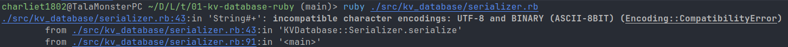

# Thought process 3 (pair programming if you're reading this)

## Serializer

### Fixing how `serialize` works

Following what was left as pending in the previous part, now it's time to fix the implementation of the `serialize` method because it doesn't serialize the whole data, only the key and the value. To achieve this, I need to think in the order of the data. First it goes the CRC checksum that will be generated using the whole data. I already have the binary string for both key and value, but I don't have the header, which is the epoch timestamp, the key size, the value size, the key type and the value type. So let's see how to create the header and then join the key and value to it to form the CRC and finally join the CRC with the header and the key and value to have the whole thing.

The epoch timestamp comes already from the parameter, but I need to pack it into a binary string. Can I use the format from `DATA_TYPE_FORMAT` for integers? Ye... no, because that map is for the key and the value formats, where I want as much information as possible, but for the header parts, I want fixed formats depending on how much data I want to put in there. This timestamp can hold 4 bytes of an unsigned integer (a negative value would represent dates before January 1st, 1970 at midnight, and I don't care about those), and the format for that is `"L<"`. The `pack` method that I implemented doesn't take a format, so what can I do? Put each part of the header inside an array and use the original `pack` method. (This is inside `serialize`):

```rb
epoch_bytes = [epoch].pack("L<")
```

Now the key size, which will use the same format.

```rb
key_size_bytes = [key_size].pack("L<")
```

Now the value size, with the same format.

```rb
value_size_bytes = [value_size].pack("L<")
```

Now the key type, which is only 1 byte for an unsigned integer. For this I can use the `"C"` format, that is for unsigned chars, but that's effectively 1 unsigned byte, so it works for me. No need for `"<"` at the end because it's just 1 byte, so you can only order it in 1 way. Remember that I'll pass here the mapped integer for the type.

```rb
key_type_bytes = [DATA_TYPE_INTEGER[key_type]].pack("C")
```

Now the value type also with the `"C"` format.

```rb
value_type_bytes = [DATA_TYPE_INTEGER[value_type]].pack("C")
```

With all that in place, I can create the whole thing (except the checksum).

```rb
def self.serialize(key:, value:, epoch: Time.now.to_i)
  key_type = type(key)
  value_type = type(value)

  key_size = size(data: key, type: key_type)
  value_size = size(data: value, type: value_type)

  key_bytes = pack(data: key, type: key_type)
  value_bytes = pack(data: value, type: value_type)

  epoch_bytes = [epoch].pack("L<")
  key_size_bytes = [key_size].pack("L<")
  value_size_bytes = [value_size].pack("L<")
  key_type_bytes = [DATA_TYPE_INTEGER[key_type]].pack("C")
  value_type_bytes = [DATA_TYPE_INTEGER[value_type]].pack("C")

  return [CRC32_SIZE + HEADER_SIZE + key_size + value_size, epoch_bytes + key_size_bytes + value_size_bytes + key_type_bytes + value_type_bytes + key_bytes + value_bytes]
end
```

The test still passes, of course.

It's difficult to read, so let's refactor. I can move the size to a `size` variable:

```rb
def self.serialize(key:, value:, epoch: Time.now.to_i)
  key_type = type(key)
  value_type = type(value)

  key_size = size(data: key, type: key_type)
  value_size = size(data: value, type: value_type)

  size = CRC32_SIZE + HEADER_SIZE + key_size + value_size

  key_bytes = pack(data: key, type: key_type)
  value_bytes = pack(data: value, type: value_type)

  epoch_bytes = [epoch].pack("L<")
  key_size_bytes = [key_size].pack("L<")
  value_size_bytes = [value_size].pack("L<")
  key_type_bytes = [DATA_TYPE_INTEGER[key_type]].pack("C")
  value_type_bytes = [DATA_TYPE_INTEGER[value_type]].pack("C")

  return [size, epoch_bytes + key_size_bytes + value_size_bytes + key_type_bytes + value_type_bytes + key_bytes + value_bytes]
end
```

It still passes. Now let's move the header data and the data of the key and the value to auxiliary variables, one will be `header` and the other just `data`:

```rb
def self.serialize(key:, value:, epoch: Time.now.to_i)
  key_type = type(key)
  value_type = type(value)

  key_size = size(data: key, type: key_type)
  value_size = size(data: value, type: value_type)

  size = CRC32_SIZE + HEADER_SIZE + key_size + value_size

  key_bytes = pack(data: key, type: key_type)
  value_bytes = pack(data: value, type: value_type)

  epoch_bytes = [epoch].pack("L<")
  key_size_bytes = [key_size].pack("L<")
  value_size_bytes = [value_size].pack("L<")
  key_type_bytes = [DATA_TYPE_INTEGER[key_type]].pack("C")
  value_type_bytes = [DATA_TYPE_INTEGER[value_type]].pack("C")

  header = epoch_bytes + key_size_bytes + value_size_bytes + key_type_bytes + value_type_bytes
  data = key_bytes + value_bytes

  return [size, header + data]
end
```

The test still passes. Now that I know what "the whole thing" is without the checksum, I know what to pass to generate that checksum, simply `header + data`.

```rb
crc32(header + data)
```

But, this will generate the checksum, which is an integer, and what I want is the binary string to be able to append it to the header and the data. The question then is, `crc32` should return the packed checksum or just the checksum? To me it makes more sense to return just the checksum, I wouldn't expect it to return a binary string of the checksum. So I prefer:

```rb
crc32_bytes = [crc32(header + data)].pack("L<") # L< because it's 4 bytes for an unsigned integer as well
```

to get that part of the record. Stitching everything together:

```rb
def self.serialize(key:, value:, epoch: Time.now.to_i)
  key_type = type(key)
  value_type = type(value)

  key_size = size(data: key, type: key_type)
  value_size = size(data: value, type: value_type)

  size = CRC32_SIZE + HEADER_SIZE + key_size + value_size

  key_bytes = pack(data: key, type: key_type)
  value_bytes = pack(data: value, type: value_type)

  epoch_bytes = [epoch].pack("L<")
  key_size_bytes = [key_size].pack("L<")
  value_size_bytes = [value_size].pack("L<")
  key_type_bytes = [DATA_TYPE_INTEGER[key_type]].pack("C")
  value_type_bytes = [DATA_TYPE_INTEGER[value_type]].pack("C")

  header = epoch_bytes + key_size_bytes + value_size_bytes + key_type_bytes + value_type_bytes
  data = key_bytes + value_bytes

  crc32_bytes = [crc32(header + data)].pack("L<")

  return [size, crc32_bytes + header + data]
end
```

And now, not only the test passes, but also the data is properly serialized.

### Refactoring header serialization

The only problem I see is that the function is a bit long, how could we make it shorter? What things is it doing that could be handled by someone else? Well, the record has three parts: checksum, header and data. The checksum has a dedicated function already, and the data just needs to be packed. So the header building process could be moved to another function called `serialize_header`. How should this look like? Well, the header needs `epoch`, `key_size`, `value_size`, `key_type` and `value_type`, and from there it can create the binary string internally, so it needs to have the interface `serialize_header(epoch:, key_size:, value_size:, key_type:, value_type:)`. Let's implement it:

```rb
def self.serialize_header(epoch: Time.now.to_i, key_size:, value_size:, key_type:, value_type:)
  epoch_bytes = [epoch].pack("L<")
  key_size_bytes = [key_size].pack("L<")
  value_size_bytes = [value_size].pack("L<")
  key_type_bytes = [DATA_TYPE_INTEGER[key_type]].pack("C")
  value_type_bytes = [DATA_TYPE_INTEGER[value_type]].pack("C")

  header = epoch_bytes + key_size_bytes + value_size_bytes + key_type_bytes + value_type_bytes

  return header
end
```

And use it:

```rb
def self.serialize(key:, value:, epoch: Time.now.to_i)
  key_type = type(key)
  value_type = type(value)

  key_size = size(data: key, type: key_type)
  value_size = size(data: value, type: value_type)

  size = CRC32_SIZE + HEADER_SIZE + key_size + value_size

  key_bytes = pack(data: key, type: key_type)
  value_bytes = pack(data: value, type: value_type)

  header = serialize_header(epoch: epoch, key_size: key_size, value_size: value_size, key_type: key_type, value_type: value_type)
  data = key_bytes + value_bytes

  crc32_bytes = [crc32(header + data)].pack("L<")

  return [size, crc32_bytes + header + data]
end
```

Looks better, and the test still passes, but there's still room for improvement in how `serialize_header` works internally. Since the header is a whole, and it's possible to pack all the elements at once using a format per element, what if I just do:

```rb
def self.serialize_header(epoch:, key_size:, value_size:, key_type:, value_type:)
  return [epoch, key_size, value_size, DATA_TYPE_INTEGER[key_type], DATA_TYPE_INTEGER[value_type]].pack("L<L<L<CC")
end
```

The test still passes, so it works as expected, since all the packed parts are an array, joining them is just joining elements of an array to form a larger array, knowing where the limits are based on the size of each part. As another improvement, I don't like having the format for the header hardcoded in there, and when you don't like hardcoded things, you just introduce constants. So I'll introduce a `HEADER_FORMAT` constant for this:

```rb
HEADER_FORMAT = "L<L<L<CC"
```

And now just use it:

```rb
def self.serialize_header(epoch:, key_size:, value_size:, key_type:, value_type:)
  return [epoch, key_size, value_size, DATA_TYPE_INTEGER[key_type], DATA_TYPE_INTEGER[value_type]].pack(HEADER_FORMAT)
end
```

The test still passes.

### Refactoring CRC-32-compliant checksum format

Now the only magic string is here in `serialize`:

```rb
crc32_bytes = [crc32(header + data)].pack("L<")
```

So I'll move that to a constant as well:

```rb
CRC32_FORMAT = "L<"
```

And use it:

```rb
def self.serialize(key:, value:, epoch: Time.now.to_i)
  key_type = type(key)
  value_type = type(value)

  key_size = size(data: key, type: key_type)
  value_size = size(data: value, type: value_type)

  size = CRC32_SIZE + HEADER_SIZE + key_size + value_size

  key_bytes = pack(data: key, type: key_type)
  value_bytes = pack(data: value, type: value_type)

  header = serialize_header(epoch: epoch, key_size: key_size, value_size: value_size, key_type: key_type, value_type: value_type)
  data = key_bytes + value_bytes

  crc32_bytes = [crc32(header + data)].pack(CRC32_FORMAT)

  return [size, crc32_bytes + header + data]
end
```

The test still passes and how the functions are structured looks better now. Some may argue that it is still long, but to me, it's just fine because it's very easy to follow if you understand how the record is going to be stored.

### Creating a test for serializing the header

Perhaps I inverted the process, but I guess sometimes that just happens because of how things end up working, because now I will create a test for `serialize_header` using a specific timestamp. What should I test? Essentially the same, that the size is equal to the size of the header and that the header is not empty.

```rb
it "serializes the header" do
  header_size = 14

  header = KVDatabase::Serializer.serialize_header(epoch: 1_747_005_652, key_size: 10, value_size: 100, key_type: :Integer, value_type: :Float)

  expect(header.length).to eq(header_size)
  expect(header).not_to be_empty
end
```

The test will pass, as expected, so now this function is also covered by a test.

### Refactoring tests for serializing data

Now it's time to refactor a bit the test for serializing, because both need `header_size`, so I'll move that to a memoized variable that can be used in any test of the suite.

```rb
RSpec.describe KVDatabase::Serializer do
  let(:header_size) { 14 }
  # rest of memoized variables and tests
end
```

And just remove `header_size` from the tests:

```rb
RSpec.describe KVDatabase::Serializer do
  let(:header_size) { 14 }
  let(:key) { Faker::Lorem.word }
  let(:value) { Faker::Lorem.sentence(word_count: 5_000) }

  describe "#serialize" do
    let(:key) { "café" }
    let(:value) { Faker::Lorem.sentence(word_count: 5_000) }

    it "serializes" do
      crc_size = 4
      crc_and_header_size = crc_size + header_size

      size, data = KVDatabase::Serializer.serialize(key: key, value: value)

      key_size = KVDatabase::Serializer.size(data: key, type: :String)
      value_size = KVDatabase::Serializer.size(data: value, type: :String)
      expected_size = crc_and_header_size + key_size + value_size

      expect(size).to eq(expected_size)
      expect(data).not_to be_empty
    end
  end

  it "serializes the header" do
    header = KVDatabase::Serializer.serialize_header(epoch: 1_747_005_652, key_size: 10, value_size: 100, key_type: :Integer, value_type: :Float)

    expect(header.length).to eq(header_size)
    expect(header).not_to be_empty
  end

  # rest of the tests
end
```

It will pass because the name is the same, so there are no more changes left.

### Thinking about `deserialize`

The next thing to do is the inverse of this process, which is to implement the `deserialize` method. What do I expect from it? What information do I need to pass it to make it work? Well, I actually need the whole record, from checksum to value. I need the checksum for comparison and to know that the integrity of the data hasn't been compromised. I need the header because the key and value size will help me to know where the key starts and finishes and where the value starts and finishes, and the key and value type will help me to know how to "interpret" the stored data, if it's an integer, a float, or a string, and unpack the value properly. The result that I would expect from it would be to get the right epoch, key and value.

This test will be a bit more complicated, because the data is in binary string format. But before that, while I was trying to get the expected binary string using `serialize`, I noticed that it would fail with special characters.

### Fixing `serialize` implementation for special characters

For this input:

```rb
# src/kv_database/serializer.rb

# module (KVDatabase, Serializer and all that)

if __FILE__ == $0
  puts KVDatabase::Serializer.serialize(key: "café", value: 1.23, epoch: 1_747_005_650).to_s
end
```

It failed:



First let's change the memoized `key` for tests to use special characters:

```rb
let(:key) { "café" }
```

The test will fail. This all failed because the encoding of the binary strings is not the same. `"café"` is encoded using UTF-8, where as `1.23` is packed as a binary string with the `ASCII-8-BIT` encoding. This let me see that the test was not so reliable because it didn't take these cases into account. Let's understand what encoding means and how to fix it:

Encoding has nothing to do with storing strings, it's not like "storing in ASCII or UTF-8". A string will be converted into the right array of bytes regardless of how it's encoded. By default, at least in Ruby, binary strings are encoded in ASCII-8-BIT because the bytes are just seen as raw values, without interpreting them as characters. So, why encoding into UTF-8 if the binary string will be the right one anyway? Because someone has to make that process. If in `pack` I just do nothing for a string, I'll just get the string itself, not the binary string, and since I want to say that the text that will be there might contain special characters, I use UTF-8. So, in summary, encoding is just about interpretation, not about storage, but it needs to be clear in some place what's the encoding that is expected or used.

So it's okay to encode any string as UTF-8 before building the whole record just to be on the same party of the binary strings. But if all the data that is not a string (integers and floats) will be converted into a binary string with a different encoding, the only way to fix this is by ensuring that both `key_bytes` and `value_bytes`, which are the only ones who can be strings, are in the same encoding as the others.

```rb
def self.serialize(key:, value:, epoch: Time.now.to_i)
  key_type = type(key)
  value_type = type(value)

  key_size = size(data: key, type: key_type)
  value_size = size(data: value, type: value_type)

  size = CRC32_SIZE + HEADER_SIZE + key_size + value_size

  key_bytes = pack(data: key, type: key_type).force_encoding(Encoding::ASCII_8BIT)
  value_bytes = pack(data: value, type: value_type).force_encoding(Encoding::ASCII_8BIT)

  header = serialize_header(epoch: epoch, key_size: key_size, value_size: value_size, key_type: key_type, value_type: value_type)
  data = key_bytes + value_bytes

  crc32_bytes = [crc32(header + data)].pack(CRC32_FORMAT)

  return [size, crc32_bytes + header + data]
end
```

Now the test will pass. What troubled me at first, and the reason why I explained a lot about encoding not being storage, is because, if you think about

```rb
key_bytes = pack(data: key, type: key_type).force_encoding(Encoding::ASCII_8BIT)
value_bytes = pack(data: value, type: value_type).force_encoding(Encoding::ASCII_8BIT)
```

in a way that `.force_encoding(Encoding::ASCII_8BIT)` will make that the `"é"` in café gets lost, that's wrong, because encoding is not storage, there's no byte manipulation. It's just an indication of how these strings should be interpreted when you want to read them. So it doesn't matter. The text will be preserved and when we want to read it, we know that we have to interpret it as UTF-8.

Now the test will pass again and I'll leave `key` as `"café"` in the test suite to have full confidence on this test.

### Making the tests for `deserialize` pass

After fixing this, I'll go back to the test for `deserialize`, which is interesting.

```rb
describe "#deserializes" do
  let(:serialized_data_1) { OpenStruct.new(
    raw: "\x1E+`K\xD20!h\x05\x00\x00\x00\b\x00\x00\x00\x03\x02caf\xC3\xA9\xAEG\xE1z\x14\xAE\xF3?",
    epoch: 1_747_005_650,
    key: "café",
    value: 1.23
  )}
  let(:serialized_data_2) { OpenStruct.new(
    raw: "\xC8M\xD9M\xD30!h\x06\x00\x00\x00\x11\x00\x00\x00\x03\x03\xC3\xA9liteRandom expression",
    epoch: 1_747_005_651,
    key: "élite",
    value: "Random expression"
  )}
  let(:serialized_data_3) { OpenStruct.new(
    raw: "\x8D\xBB\xA9\x93\xD40!h\b\x00\x00\x00\b\x00\x00\x00\x01\x01\x18\x00\x00\x00\x00\x00\x00\x00\n\x00\x00\x00\x00\x00\x00\x00",
    epoch: 1_747_005_652,
    key: 24,
    value: 10
  )}

  it "deserializes" do
    epoch, key, value = KVDatabase::Serializer.deserialize(serialized_data_1.raw)

    expect(epoch).to eq(serialized_data_1.epoch)
    expect(key).to eq(serialized_data_1.key)
    expect(value).to eq(serialized_data_1.value)
  end

  it "deserializes" do
    epoch, key, value = KVDatabase::Serializer.deserialize(serialized_data_2.raw)

    expect(epoch).to eq(serialized_data_2.epoch)
    expect(key).to eq(serialized_data_2.key)
    expect(value).to eq(serialized_data_2.value)
  end

  it "deserializes" do
    epoch, key, value = KVDatabase::Serializer.deserialize(serialized_data_3.raw)

    expect(epoch).to eq(serialized_data_3.epoch)
    expect(key).to eq(serialized_data_3.key)
    expect(value).to eq(serialized_data_3.value)
  end
end
```

Looks complicated, but it's pretty simple. `OpenStruct` is just a constructor of key-value structures where the attributes or properties can be accessed using dot notation. A hash (or object if you come from JS), can be used, but the dot notation cannot be used with them. That's why OpenStruct is preferred for these situations. I'm gonna test three different structs. `raw` will hold the binary string for the whole record (the one I got from using `serialize`). The tests will check that `epoch`, `key` and `value` are properly interpreted from the binary string (the serialized data). The tests will fail because `deserialize` doesn't even exist. But let's see how to make these tests pass in the next part, because this one is already long.
