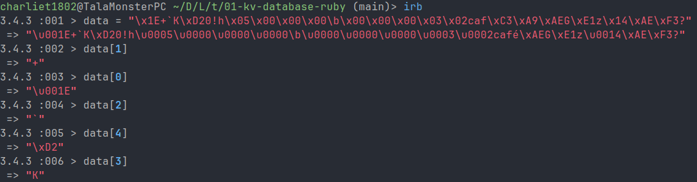
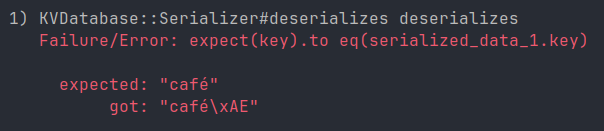

# Thought process 4 (pair programming if you're reading this)

## Serializer

### Making the tests for `deserialize` pass

Let's see how to make the tests for `deserialize` pass. Okay, of course it's not possible to create a fake implementation because I have three different tests, and even if I had only one, a fake implementation wouldn't help me to figure out how to make this pass. So what I can do is think about how I can extract each part, starting from the epoch timestamp. I know that the first part is the checksum, so... wait, if the first part is the checksum, shouldn't I start by checking that it's correct because that's the whole purpose of the checksum? But that would demand me more tests and right now I have tests in red, so I'll just leave it for when the current tests already pass.

I know that the checksum uses 4 bytes, so if I "move" 4 bytes, I'll end up in the epoch timestamp. The question is, in a binary string, how do I "move" through the bytes? Playing in the IRB (Interactive Ruby), I saw that I can access each byte using their position within the string:



The tricky thing here, and why I talked so much about encoding, is that the binary string in the example contains `"café"`, but `"é"` needs two bytes, but if I access it in `data[21]`, I'll see the whole thing, even though I'm missing `data[22]`. Why? Because Ruby is interpreting the string in UTF-8 by default, so it "detects" the first byte of the `"é"` character, takes the second one and display the whole thing. But this is just a sidenote because that's why, to avoid this juggling and confusion, I have stored the key and value sizes in the serialized data. Now let's have fun with some math:

I know that if I move 4 bytes to the right to skip the checksum, I'll start in `data[4]` for the epoch timestamp, and if its size is 4 bytes, then it ends in `data[7]`. For the key, I know that `key_size` is in `data[8]` to `data[11]` (4 bytes as well). For the value, I know that `value_size` is in `data[12]` to `data[15]` (4 bytes as well). Then for the types, I have `key_type` in `data[16]`, since it's just 1 byte, and `value_size` is in `data[17]`. Therefore, `key` starts in `data[18]` and ends in `data[18 + (key_size - 1)]`. If `key_size` is 3, then it would cover 18, 19 and 20, so `18 + (3 - 1) = 18 + 2 = 20`. That means that `value` starts in `data[18 + key_size]` and ends in `data[18 + key_size + (value_size - 1)]` (or in practical terms, until the end of data).

I use fixed sizes because I know them, but these values will depend on the sizes defined in the constants, and of course, given that the sizes are packed, I need to unpack them first to get the actual value. So let's go step by step. First identify epoch timestamp:

```rb
def self.deserialize(data)
  unpacked_epoch = unpack(data[CRC32_SIZE], ?)
end
```

Oh, I actually cannot do it one by one because the format is in `HEADER_FORMAT`. Well then, I don't need to go one by one because I know the range of the header and then I can use the sizes to know the range of the data. The range for the header is `CRC32_SIZE` to `CRC32_SIZE + HEADER_SIZE - 1`. So:

```rb
def self.deserialize(data)
  header_data = data[CRC32_SIZE..CRC32_SIZE + HEADER_SIZE - 1].unpack(HEADER_FORMAT)
  return [header_data[0], 0, 0]
end
```

`..` in Ruby is for creating an inclusive range (includes the end). This way I can return an array with the epoch timestamp in the first position, and then just zeroes for key and value. If I run the tests, now I get errors regarding the keys, which means that the epoch is matching and it's working. Now I need to know where the key starts and ends and what type it has so I can unpack it properly. `key_size` is in `header_data[1]`, and `key_type` is in `header_data[3]`, but `key_type` is the integer assigned to the type, not the actual type. But thinking about it, I don't have a map where the keys are integers and map to symbols.

### Pause to fix how types are handled

Given this, I think I first need to go to check that before proceeding, but I'll comment the `deserialize` tests to be sure that my changes won't break anything. I see that I would have to swap these:

```rb
DATA_TYPE_INTEGER = {
  Integer: 1,
  Float:  2,
  String: 3
}.freeze

DATA_TYPE_SYMBOL = {
  DATA_TYPE_INTEGER[:Integer] => :Integer,
  DATA_TYPE_INTEGER[:Float] => :Float,
  DATA_TYPE_INTEGER[:String] => :String
}.freeze
```

But if I do that, then I also need to change `DATA_TYPE_FORMAT`:

```rb
DATA_TYPE_FORMAT = {
  DATA_TYPE_INTEGER[:Integer] => "q<",
  DATA_TYPE_INTEGER[:Float] => "E"
}.freeze
```

But now the problem is here:

```rb
def self.pack(data:, type:)
  case type
  when DATA_TYPE_SYMBOL[:Integer], DATA_TYPE_SYMBOL[:Float]
    return [data].pack(DATA_TYPE_FORMAT[type])
  when DATA_TYPE_SYMBOL[:String]
    return data.encode(Encoding::UTF_8)
  else
    raise StandardError, "Invalid type"
  end
end

def self.unpack(data:, type:)
  case type
  when DATA_TYPE_SYMBOL[:Integer], DATA_TYPE_SYMBOL[:Float]
    return data.unpack1(DATA_TYPE_FORMAT[type])
  when DATA_TYPE_SYMBOL[:String]
    return data
  else
    raise StandardError, "Invalid type"
  end
end
```

Because now the indices are numbers, not symbols, so I would have to get the integer using the symbol and then use the integer to get the symbol. Hmm... seems messy. I think the pragmatic approach here would be to just use fixed symbols, because this "overmapping" actually introduces more complexity. In the case of `DATA_TYPE_FORMAT`, this is inevitable, so I'll first create a `format` function:

```rb
def self.format(type)
  return DATA_TYPE_FORMAT[DATA_TYPE_INTEGER[type]]
end
```

And use it:

```rb
def self.pack(data:, type:)
  case type
  when DATA_TYPE_SYMBOL[:Integer], DATA_TYPE_SYMBOL[:Float]
    return [data].pack(format(type))
  when DATA_TYPE_SYMBOL[:String]
    return data.encode(Encoding::UTF_8)
  else
    raise StandardError, "Invalid type"
  end
end

def self.unpack(data:, type:)
  case type
  when DATA_TYPE_SYMBOL[:Integer], DATA_TYPE_SYMBOL[:Float]
    return data.unpack1(format(type))
  when DATA_TYPE_SYMBOL[:String]
    return data
  else
    raise StandardError, "Invalid type"
  end
end
```

And now fix the cases:

```rb
def self.pack(data:, type:)
  case type
  when :Integer, :Float
    return [data].pack(format(type))
  when :String
    return data.encode(Encoding::UTF_8)
  else
    raise StandardError, "Invalid type"
  end
end

def self.unpack(data:, type:)
  case type
  when :Integer, :Float
    return data.unpack1(format(type))
  when :String
    return data
  else
    raise StandardError, "Invalid type"
  end
end
```

The tests will now pass.

### Making the tests for `deserialize` pass (now for real)

I'm going to uncomment the `deserialize` tests now that we're safe again. I'll explicitly store each part: `epoch`, `key_size`, `value_size`, `key_type` and `value_type` for clarity:

```rb
def self.deserialize(data)
  epoch, key_size, value_s9ze, key_type, value_type = data[CRC32_SIZE..CRC32_SIZE + HEADER_SIZE - 1].unpack(HEADER_FORMAT)

  return [epoch, 0, 0]
end
```

The tests still fail with the key, so it's okay. Now, let's get key and value using `unpack` and their types using `DATA_TYPE_SYMBOL` to get the symbols from the unpacked integers:

```rb
def self.deserialize(data)
  epoch, key_size, _, key_type, value_type = data[CRC32_SIZE..CRC32_SIZE + HEADER_SIZE - 1].unpack(HEADER_FORMAT)

  key = unpack(data: data[CRC32_SIZE + HEADER_SIZE..CRC32_SIZE + HEADER_SIZE + key_size - 1], type: key_type)
  value = unpack(data: data[CRC32_SIZE + HEADER_SIZE + key_size..], type: value_type)

  return [epoch, key, value]
end
```

`value_size` is not actually needed because the value ends where `data` ends, hence the underscore (`_`). This should work, except it doesn't for the current test cases because they involve special characters.



Since I don't see the test without special characters involved failing, it means that the logic is fine, except for special characters. So let's figure out why they fail. Focusing on `"café"`, the test is telling me that instead of `"café"` it got `"café\xAE"`. That means that I'm getting 1 extra byte, `"\xAE"`. Why? Let's see. `"é"` is represented with 2 bytes. My logic to deserialize relies on the indices of `data`. `"café"` has 4 characters, but 5 bytes, so it should work, right? Because I'm correctly handling the ranges of the indices to interpret each part of the raw data. But...strings are assumed to be encoded in UTF-8 in Ruby, which means that `"é"` will have 2 bytes in memory, but Ruby will read it as a whole, which is something I explained above. That means that if I'm looking for 5 bytes, Ruby will interpret `"é"` as a whole, so it will grab the 2 bytes and say "This is just 1 character" so when I reach the 5th byte, I'll get `"\xAE"`, not the last part of `"é"`. How to fix it then? By not interpreting the characters when accessing the "slice" that might contain special characters, which here is only `key` or `value`. That means, force `data`, the binary string, to be encoded not in UTF-8, but in ASCII-8-BIT.

```rb
def self.deserialize(data)
  raw_data = data.dup.force_encoding(Encoding::ASCII_8BIT)

  epoch, key_size, _, key_type, value_type = raw_data[CRC32_SIZE..CRC32_SIZE + HEADER_SIZE - 1].unpack(HEADER_FORMAT)

  key = unpack(data: raw_data[CRC32_SIZE + HEADER_SIZE..CRC32_SIZE + HEADER_SIZE + key_size - 1].force_encoding(Encoding::UTF_8), type: key_type)
  value = unpack(data: raw_data[CRC32_SIZE + HEADER_SIZE + key_size..].force_encoding(Encoding::UTF_8), type: value_type)

  return [epoch, key, value]
end
```

`dup` (duplicate) takes a shallow copy of `data` because, besides being a good practice to not mutate original values to avoid modifying unexpected references, `data` is immutable because of that little comment at the top of the file: `# frozen_string_literal: true`. By "playing" with the indices over a string where the characters are not interpreted, it's safe to rely on bytes positions, but to not lose the interpretation of the special characters, after getting the "slice" of that uninterpreted string, it's encoded back to UTF-8 before trying to unpack it. Now the tests will pass, so this was the right approach. Some may argue that using special characters for keys should not be supported for simplicity, and at least I'd never use, if I can control it, special characters for keys, but this is an inevitable situation with `value`, where these characters might exist and there's nothing wrong with it, so if the implementation needs to work for special characters in `value`, then doing the same for `key` is just a natural choice.

### Refactoring `deserialize` to separate header deserialization

Before moving forward, I'll do a little refactor as I did with `serialize`. If I have `serialize` and `serialize_header`, is just natural to think that I should have `deserialize` and `deserialize_header` as well, so I'll move the header logic to `deserialize_header`, and it will take the packed header data from `raw_data` to avoid computing it twice (one for header, one for `key` and `value`):

```rb
def self.deserialize_header(header_data)
  header = header_data.unpack(HEADER_FORMAT)

  return [header[0], header[1], header[2], DATA_TYPE_SYMBOL[header[3]], DATA_TYPE_SYMBOL[header[4]]]
end
```

Note that I return the types as symbols already, because that's how I want to use them, not as integers. And now use it:

```rb
def self.deserialize(data)
  raw_data = data.dup.force_encoding(Encoding::ASCII_8BIT)

  epoch, key_size, _, key_type, value_type = deserialize_header(raw_data[CRC32_SIZE..CRC32_SIZE + HEADER_SIZE - 1])

  key = unpack(data: raw_data[CRC32_SIZE + HEADER_SIZE..CRC32_SIZE + HEADER_SIZE + key_size - 1].force_encoding(Encoding::UTF_8), type: key_type)
  value = unpack(data: raw_data[CRC32_SIZE + HEADER_SIZE + key_size..].force_encoding(Encoding::UTF_8), type: value_type)

  return [epoch, key, value]
end
```

And the tests still pass, so it works. Now, I'll introduce auxiliary variables for getting the "slice" for `key` and `value` from `raw_data` to avoid lines so long.

```rb
def self.deserialize(data)
  raw_data = data.dup.force_encoding(Encoding::ASCII_8BIT)

  epoch, key_size, _, key_type, value_type = deserialize_header(raw_data)

  key_bytes = raw_data[CRC32_SIZE + HEADER_SIZE..CRC32_SIZE + HEADER_SIZE + key_size - 1]
  value_bytes = raw_data[CRC32_SIZE + HEADER_SIZE + key_size..]

  key = unpack(data: key_bytes.force_encoding(Encoding::UTF_8), type: key_type)
  value = unpack(data: value_bytes.force_encoding(Encoding::UTF_8), type: value_type)

  return [epoch, key, value]
end
```

### Validating checksum

That looks better. `deserialize` is do... no, wait. I remember that the checksum verification is pending. How to implement that? Well, essentially I need to check that the checksum that comes from `data` is the same that would be generated from the whole thing, `crc32(header + data)` (where `header` and `data` are packed already), which is what I did in `serialize`. I could just put the logic inside `deserialize`, but I know for sure that this needs to be a dedicated check function. A good name would be `is_crc32_valid`. What does it need? Only the checksum, but not the binary string of the packed checksum, the integer checksum, because that's what `crc32` returns. So I know it should look like:

```rb
def self.is_crc32_valid(checksum, data_bytes)
  return checksum == crc32(data_bytes)
end
```

Some may say that I'm getting ahead of myself because I'm thinking about the implementation before the test, but let's be honest, I just thought about the obvious implementation before creating the test, so it isn't like I broke the whole workflow. I could create a test for this, but that would need me to expose the format to unpack the checksum, and that would give details about the internal implementation, so I guess that would be a test coupled to the implementation. So I'll create a test instead for what `deserialize` should return when the checksum is not valid:

```rb
it "returns expected values for invalid CRC-32-compliant checksum" do # Inside the describe #deserialize block
  epoch, key, value = KVDatabase::Serializer.deserialize("\x2E+`K\xD20!h\x05\x00\x00\x00\b\x00\x00\x00\x03\x02caf\xC3\xA9\xAEG\xE1z\x14\xAE\xF3?")

  expect(epoch).to eq(0)
  expect(key).to eq('')
  expect(value).to eq('')
end
```

This will fail, of course. I think this could work:

```rb
def self.deserialize(data)
  raw_data = data.dup.force_encoding(Encoding::ASCII_8BIT)
  
  if !is_crc32_valid(raw_data[..CRC32_SIZE - 1], raw_data[CRC32_SIZE..])
    return 0, '', ''
  end

  epoch, key_size, _, key_type, value_type = deserialize_header(raw_data)

  key_bytes = raw_data[CRC32_SIZE + HEADER_SIZE..CRC32_SIZE + HEADER_SIZE + key_size - 1]
  value_bytes = raw_data[CRC32_SIZE + HEADER_SIZE + key_size..]

  key = unpack(data: key_bytes.force_encoding(Encoding::UTF_8), type: key_type)
  value = unpack(data: value_bytes.force_encoding(Encoding::UTF_8), type: value_type)

  return [epoch, key, value]
end
```

Almost, because `raw_data[..CRC32_SIZE - 1]` is the binary string, not the unpacked integer, so I need to unpack it first. I know that I will get only 1 integer, so I can safely use `unpack1`, and what's the format? Well, let's remember that I have it in `CRC32_FORMAT` because I need for `serialize`:

```rb
def self.deserialize(data)
  raw_data = data.dup.force_encoding(Encoding::ASCII_8BIT)

  unpacked_crc32 = raw_data[..CRC32_SIZE - 1].unpack1(CRC32_FORMAT)

  if !is_crc32_valid(unpacked_crc32, raw_data[CRC32_SIZE..])
    return 0, '', ''
  end

  epoch, key_size, _, key_type, value_type = deserialize_header(raw_data)

  key_bytes = raw_data[CRC32_SIZE + HEADER_SIZE..CRC32_SIZE + HEADER_SIZE + key_size - 1]
  value_bytes = raw_data[CRC32_SIZE + HEADER_SIZE + key_size..]

  key = unpack(data: key_bytes.force_encoding(Encoding::UTF_8), type: key_type)
  value = unpack(data: value_bytes.force_encoding(Encoding::UTF_8), type: value_type)

  return [epoch, key, value]
end
```

And now the test passes.

### Refactoring `deserialize` to separate checksum deserialization

Now I want to refactor because it looks like unpacking the checksum should not be a responsibility of this function. So I'll introduce a new function, `deserialize_crc32`. Why not `unpack_crc32`? Because I want to imply that this is the deserialization process for the checksum, the same way it is for `deserialize_header`.

```rb
def self.deserialize_crc32(checksum_bytes)
  return checksum_bytes.unpack1(CRC32_FORMAT)
end
```

I just pass it the "slice" with the checksum because I don't need to pass the whole data because I only need the checksum. And now use it:

```rb
def self.deserialize(data)
  raw_data = data.dup.force_encoding(Encoding::ASCII_8BIT)

  if !is_crc32_valid(deserialize_crc32(raw_data[..CRC32_SIZE - 1]), raw_data[CRC32_SIZE..])
    return 0, '', ''
  end

  epoch, key_size, _, key_type, value_type = deserialize_header(raw_data)

  key_bytes = raw_data[CRC32_SIZE + HEADER_SIZE..CRC32_SIZE + HEADER_SIZE + key_size - 1]
  value_bytes = raw_data[CRC32_SIZE + HEADER_SIZE + key_size..]

  key = unpack(data: key_bytes.force_encoding(Encoding::UTF_8), type: key_type)
  value = unpack(data: value_bytes.force_encoding(Encoding::UTF_8), type: value_type)

  return [epoch, key, value]
end
```

The tests still pass, so it works, and now another little refactor because it seems like the Ruby way is to do this:

```rb
def self.deserialize(data)
  raw_data = data.dup.force_encoding(Encoding::ASCII_8BIT)

  return 0, '', '' unless is_crc32_valid(deserialize_crc32(raw_data[..CRC32_SIZE - 1]), raw_data[CRC32_SIZE..])

  epoch, key_size, _, key_type, value_type = deserialize_header(raw_data)

  key_bytes = raw_data[CRC32_SIZE + HEADER_SIZE..CRC32_SIZE + HEADER_SIZE + key_size - 1]
  value_bytes = raw_data[CRC32_SIZE + HEADER_SIZE + key_size..]

  key = unpack(data: key_bytes.force_encoding(Encoding::UTF_8), type: key_type)
  value = unpack(data: value_bytes.force_encoding(Encoding::UTF_8), type: value_type)

  return [epoch, key, value]
end
```

Great, the tests are still green.

### Refactoring the tests for `deserialize`

Now I want another refactor, but for the tests, to group them in a better way. Right now, the `#deserialize` block looks like this:

```rb
describe "#deserializes" do
  let(:serialized_data_1) { OpenStruct.new(
    raw: "\x1E+`K\xD20!h\x05\x00\x00\x00\b\x00\x00\x00\x03\x02caf\xC3\xA9\xAEG\xE1z\x14\xAE\xF3?",
    epoch: 1_747_005_650,
    key: "café",
    value: 1.23
  )}
  let(:serialized_data_2) { OpenStruct.new(
    raw: "\xC8M\xD9M\xD30!h\x06\x00\x00\x00\x11\x00\x00\x00\x03\x03\xC3\xA9liteRandom expression",
    epoch: 1_747_005_651,
    key: "élite",
    value: "Random expression"
  )}
  let(:serialized_data_3) { OpenStruct.new(
    raw: "\x8D\xBB\xA9\x93\xD40!h\b\x00\x00\x00\b\x00\x00\x00\x01\x01\x18\x00\x00\x00\x00\x00\x00\x00\n\x00\x00\x00\x00\x00\x00\x00",
    epoch: 1_747_005_652,
    key: 24,
    value: 10
  )}

  it "deserializes" do
    epoch, key, value = KVDatabase::Serializer.deserialize(serialized_data_1.raw)

    expect(epoch).to eq(serialized_data_1.epoch)
    expect(key).to eq(serialized_data_1.key)
    expect(value).to eq(serialized_data_1.value)
  end

  it "deserializes" do
    epoch, key, value = KVDatabase::Serializer.deserialize(serialized_data_2.raw)

    expect(epoch).to eq(serialized_data_2.epoch)
    expect(key).to eq(serialized_data_2.key)
    expect(value).to eq(serialized_data_2.value)
  end

  it "deserializes" do
    epoch, key, value = KVDatabase::Serializer.deserialize(serialized_data_3.raw)

    expect(epoch).to eq(serialized_data_3.epoch)
    expect(key).to eq(serialized_data_3.key)
    expect(value).to eq(serialized_data_3.value)
  end

  it "returns expected values for invalid CRC-32-compliant checksum" do
    epoch, key, value = KVDatabase::Serializer.deserialize("\x2E+`K\xD20!h\x05\x00\x00\x00\b\x00\x00\x00\x03\x02caf\xC3\xA9\xAEG\xE1z\x14\xAE\xF3?")

    expect(epoch).to eq(0)
    expect(key).to eq('')
    expect(value).to eq('')
  end
  end
```

But I see that I can group the `it` blocks with `context`, so I will create a context for when the data is valid, and for when the checksum is invalid.

```rb
describe "#deserializes" do
  context "when serialized data is valid" do
    let(:serialized_data_1) { OpenStruct.new(
      raw: "\x1E+`K\xD20!h\x05\x00\x00\x00\b\x00\x00\x00\x03\x02caf\xC3\xA9\xAEG\xE1z\x14\xAE\xF3?",
      epoch: 1_747_005_650,
      key: "café",
      value: 1.23
    )}
    let(:serialized_data_2) { OpenStruct.new(
      raw: "\xC8M\xD9M\xD30!h\x06\x00\x00\x00\x11\x00\x00\x00\x03\x03\xC3\xA9liteRandom expression",
      epoch: 1_747_005_651,
      key: "élite",
      value: "Random expression"
    )}
    let(:serialized_data_3) { OpenStruct.new(
      raw: "\x8D\xBB\xA9\x93\xD40!h\b\x00\x00\x00\b\x00\x00\x00\x01\x01\x18\x00\x00\x00\x00\x00\x00\x00\n\x00\x00\x00\x00\x00\x00\x00",
      epoch: 1_747_005_652,
      key: 24,
      value: 10
    )}

    it "deserializes" do
      epoch, key, value = KVDatabase::Serializer.deserialize(serialized_data_1.raw)

      expect(epoch).to eq(serialized_data_1.epoch)
      expect(key).to eq(serialized_data_1.key)
      expect(value).to eq(serialized_data_1.value)
    end

    it "deserializes" do
      epoch, key, value = KVDatabase::Serializer.deserialize(serialized_data_2.raw)

      expect(epoch).to eq(serialized_data_2.epoch)
      expect(key).to eq(serialized_data_2.key)
      expect(value).to eq(serialized_data_2.value)
    end

    it "deserializes" do
      epoch, key, value = KVDatabase::Serializer.deserialize(serialized_data_3.raw)

      expect(epoch).to eq(serialized_data_3.epoch)
      expect(key).to eq(serialized_data_3.key)
      expect(value).to eq(serialized_data_3.value)
    end
  end

  context "when checksum is invalid" do
    it "returns expected values for invalid CRC-32-compliant checksum" do
      epoch, key, value = KVDatabase::Serializer.deserialize("\x2E+`K\xD20!h\x05\x00\x00\x00\b\x00\x00\x00\x03\x02caf\xC3\xA9\xAEG\xE1z\x14\xAE\xF3?")

      expect(epoch).to eq(0)
      expect(key).to eq('')
      expect(value).to eq('')
    end
  end
end
```

That way, besides having a better separation, the `serialized_data_n` variables are local to the context of valid data, so they're not created for the other tests.

### Handling deserialization for invalid inputs

It still works, but I see there's one missing case. What happens if the binary string is not valid?

```rb
context "when binary string is empty" do
  it "returns expected values for empty binary string" do
    epoch, key, value = KVDatabase::Serializer.deserialize("")

    expect(epoch).to eq(0)
    expect(key).to eq('')
    expect(value).to eq('')
  end
end
```

The test passes, so the function handles it well because when there's no checksum, it compares `nil` to `0` (the result of `crc32(data_bytes`), so the checksum is not valid in that case. If I introduce one more test:

```rb
context "when binary string is not a string" do
  it "returns expected values for non-string input" do
    epoch, key, value = KVDatabase::Serializer.deserialize(nil)

    expect(epoch).to eq(0)
    expect(key).to eq('')
    expect(value).to eq('')
  end
end
```

It will fail because it expects a string in `raw_data`. So I can just add a guard for an early return:

```rb
def self.deserialize(data)
  return 0, '', '' unless data.is_a?(String)

  raw_data = data.dup.force_encoding(Encoding::ASCII_8BIT)

  return 0, '', '' unless is_crc32_valid(deserialize_crc32(raw_data[..CRC32_SIZE - 1]), raw_data[CRC32_SIZE..])

  epoch, key_size, _, key_type, value_type = deserialize_header(raw_data)

  key_bytes = raw_data[CRC32_SIZE + HEADER_SIZE..CRC32_SIZE + HEADER_SIZE + key_size - 1]
  value_bytes = raw_data[CRC32_SIZE + HEADER_SIZE + key_size..]

  key = unpack(data: key_bytes.force_encoding(Encoding::UTF_8), type: key_type)
  value = unpack(data: value_bytes.force_encoding(Encoding::UTF_8), type: value_type)

  return [epoch, key, value]
end
```

And that will make the test pass. But I don't like repeating the return, so I can just use `data` instead of `raw_data` for the checksum validation because by that point, I don't care about the encoding (because the checksum won't contain special characters):

```rb
def self.deserialize(data)
  return 0, '', '' unless data.is_a?(String) && is_crc32_valid(deserialize_crc32(data[..CRC32_SIZE - 1]), data[CRC32_SIZE..])

  raw_data = data.dup.force_encoding(Encoding::ASCII_8BIT)

  epoch, key_size, _, key_type, value_type = deserialize_header(raw_data)

  key_bytes = raw_data[CRC32_SIZE + HEADER_SIZE..CRC32_SIZE + HEADER_SIZE + key_size - 1]
  value_bytes = raw_data[CRC32_SIZE + HEADER_SIZE + key_size..]

  key = unpack(data: key_bytes.force_encoding(Encoding::UTF_8), type: key_type)
  value = unpack(data: value_bytes.force_encoding(Encoding::UTF_8), type: value_type)

  return [epoch, key, value]
end
```

All the tests still pass. I guess this could be further improved, but I'll stop here. With this, `Serializer` is done. In the next part I'll start working on `DiskStore`, where the magic of dealing with files and records will happen.
