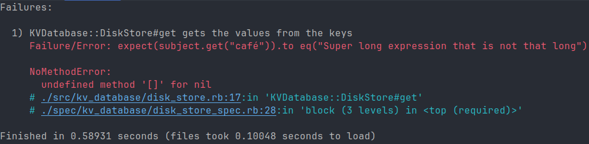
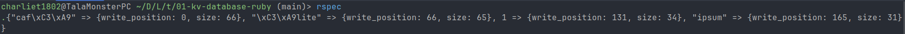
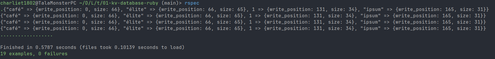

# Thought process 5 (pair programming if you're reading this)

## Serializer

### Fixing access modifier for private methods

Before diving into `DiskStore`, I'll just make private the methods that don't need to be exposed in `Serializer`:

```rb
# This is the end of the Serializer module. I like public first, then protected, and at the end, private
private

def self.size(data:, type:)
  return pack(data: data, type: type).bytes.length
end

def self.format(type)
  return DATA_TYPE_FORMAT[DATA_TYPE_INTEGER[type]]
end

def self.type(data)
  return data.class.to_s.to_sym
end
```

Okay. The tests still pass, so it's fine.

## DiskStore

### What I know (or what I believe I know)

Now let's start working on the `DiskStore` class. What do I know?

Going back to what I first knew when I started working on this, `DiskStore` needs to write new data to files and get data from files. The files will have a special extension because there needs to be a special way of reading them, and that's what `DiskStore` will do. That special extension is not so special (because it's not so creative I might say), but it's more than `.txt`. The extension is just `.db`. I'll focus on putting data first, because if I focus on getting data first, I won't even have examples to test it.

### Putting data

So, what's the process for putting data? Essentially the idea is:

1. Take the key, value and epoch and serialize the data.
2. Serializing the data will return the size and the binary string. Store the binary string in a file after the previous ones.

This function will be called `put`, since it will put something in a file (insanely creative, I know). As mentioned above, it will need the `epoch`, `key` and `value` parameters. Now the question is, should it return something? Well, if it didn't return something, I wouldn't have a way to test it, because reading the file while testing that I'm putting something into it would be a test with side effects. But I don't think I should return data from this function because I would be just returning what I gave to it, which would be fine because it would tell me that at least it didn't fail to write the record on the file, but at the same time, returning `epoch`, or `key`, or `value` would be just a matter of preference. So I guess it will just return `nil` and my tests will expect that the function returns `nil`, which will mean that it didn't fail to write the to the file.

But before creating the test. This is something new. Dealing with files. To write into a file you only need the path and some optional configuration like the encoding. So that's not hard, just have a memoized variable that holds that path. On the other hand, the file to test that `put` works is going to be created on the fly, but this is only for testing purposes, and imagine writing on it every time the tests run, it would eventually have a huge size, so it needs to be deleted, cleaned up, after the test is done.

### Creating the test to put data

Let's use this knowledge in the first test:

```rb
# spec/kv_database/disk_store_spec.rb
# frozen_string_literal: true

RSpec.describe KVDatabase::DiskStore do
  describe "#put" do
    let(:test_db_file) { "test_db_file.db" }
    let(:subject) { described_class.new }

    after do
      File.delete(test_db_file)
    end

    it 'puts a kv pair on the disk' do
      expect(subject.put(Faker::Lorem.word, Faker::Lorem.sentence)).to be_nil
      expect(subject.put("café", Faker::Lorem.sentence(word_count: 10))).to be_nil
      expect(subject.put("élite", Faker::Lorem.sentence(word_count: 100))).to be_nil
      expect(subject.put(Faker::Lorem.word, Faker::Lorem.sentence(word_count: 1000))).to be_nil
      expect(subject.put(rand(20..128), Faker::Lorem.sentence(word_count: 10_000))).to be_nil
      expect(subject.put(rand(5.3..40.2345), rand(1..10_000))).to be_nil
      expect(subject.put(rand(1..102), rand(10.2..100.234))).to be_nil
    end
  end
end
```

It looks almost fine. Why "almost"? Because, where am I saying that `DiskStore` will write on the `test_db_file.db` file? That helps me to see that I need a file path. If I passed a file path to `put`, I would be doing a nasty thing because:

1. I would have to pass the file path to `put` every time.
2. I could pass a different file path even though I wanted to write to the same file, so I would have many sources of truth for the same `DiskStore` instance.

The file path doesn't belong to `put`, because every instance of `DiskStore` represents a specific file. Therefore, `DiskStore` needs to take a file path when it's instantiated:

```rb
describe "#put" do
  let(:test_db_file) { "test_db_file.db" }
  let(:subject) { described_class.new(test_db_file) }

  after do
    File.delete(test_db_file)
  end

  it 'puts a kv pair on the disk' do
    expect(subject.put(key: Faker::Lorem.word, value: Faker::Lorem.sentence)).to be_nil
    expect(subject.put(key: "café", value: Faker::Lorem.sentence(word_count: 10))).to be_nil
    expect(subject.put(key: "élite", value: Faker::Lorem.sentence(word_count: 100))).to be_nil
    expect(subject.put(key: Faker::Lorem.word, value: Faker::Lorem.sentence(word_count: 1000))).to be_nil
    expect(subject.put(key: rand(20..128), value: Faker::Lorem.sentence(word_count: 10_000))).to be_nil
    expect(subject.put(key: rand(5.3..40.2345), value: rand(1..10_000))).to be_nil
    expect(subject.put(key: rand(1..102), value: rand(10.2..100.234))).to be_nil
  end
end
```

Now it looks good. Of course it will fail. Making this test pass will be simple, no, I'm kidding, I don't know where to start, but I'll figure it out.

### Making the test for `put` pass

First thing I know I need is to take a file path and assign it to an attribute in the constructor of `DiskStore`:

```rb
# src/kv_database/disk_store.rb
# frozen_string_literal: true

module KVDatabase
  class DiskStore
    def initialize(file_path = '1747099356_kv_database.db')
      @file_path = file_path
    end
  end
end
```

I use a default value because it just makes sense to not be forced to provide a path if you just want to try it out. But now I wonder, this path will be used to perform operations on a file, so I'll have to keep writing `File.some_method` all the time, and besides that, I would have a different and ephemeral instance of `File`. That's why I think the attribute doesn't need to be a path, but the actual `File` instance instead:

```rb
def initialize(file_path = '1747099356_kv_database.db')
  @db_file = File.open(file_path, 'a+b')
end
```

`'a+b'` is just the directive needed to open a file that will contain binary data, not plain text, and be able to append information to it and write it at the end of the file. Given that this instance will handle the appending of data, I don't need to worry about keeping track of where I need to write the new data everytime I call `put`.

Now I know that the `put` method will receive `epoch`, `key`, and `value`, but the `epoch`, when not provided, will just be `Time.now.to_i`.

```rb
def put(key:, value:, epoch: Time.now.to_i); end
```

Other thing I know is that it needs to serialize the data, and from there I'll get `size` and `data`.

```rb
require_relative 'serializer' # Don't forget this at the top of the file

def put(key:, value:, epoch: Time.now.to_i)
  size, data = Serializer.serialize(key: key, value: value, epoch: epoch)
end
```

Next thing is actually storing the data. To do this, I just need to call the `write` method on `@db_file` and pass it the data:

```rb
def put(key:, value:, epoch: Time.now.to_i)
  size, data = Serializer.serialize(key: key, value: value, epoch: epoch)

  @db_file.write(data)
end
```

And now return `nil`:

```rb
def put(key:, value:, epoch: Time.now.to_i)
  size, data = Serializer.serialize(key: key, value: value, epoch: epoch)

  @db_file.write(data)

  return nil
end
```

If I run the test now, it will pass. That was easy, wasn't it? But it was only easy because of all the previous analysis.

### Cleaning up the buffer

The test passes, but I'm missing one important thing when writing into files, which is removing any `buffer` that was created. In case you can only think about that annoying message that pops up when you're watching your favorite movie and it suddenly pauses "to load" when you read the word `buffer`, it's related, but I'll define it precisely. A `buffer` is just the name for the place where temporary binary data is stored when moving data from one place to another. They're sort of a support, helping to store data as it arrives and sending it to the expected destination. A simple and common example for using a buffer is when there's a mismatch between the amount of data that a producer can create and the amount of data that the consumer can receive. A buffer stores the produced data and passes it to the consumer, so the producer is not restricted and the consumer is not overwhelmed. Here, the data goes from the memory to the disk when it's written in a file.

To remove these buffers, it's as simple as calling `flush` on `@db_file`:

```rb
def put(key:, value:, epoch: Time.now.to_i)
  size, data = Serializer.serialize(key: key, value: value, epoch: epoch)

  @db_file.write(data)
  @db_file.flush

  return nil
end
```

Now there are no orphan buffers in memory and the test still passes. I'm not using `size` right now, but I'll see if I need it for reading the data, if not, I'll just use an underscore instead.

### Reading data

The fact that the test passes means that I can write data now, so the next step is to be able to read it. How will that test look like? I know that it will read the values from a file searching by key. So I need a test file to read from. For that I'll use known keys and values to know that to expect:

```rb
# src/kv_database/disk_store.rb
# frozen_string_literal: true

require_relative 'serializer'

module KVDatabase
  class DiskStore
    def initialize(file_path = 'kv_database.db')
      @db_file = File.open(file_path, 'a+b')
    end

    def put(key:, value:, epoch: Time.now.to_i)
      size, data = Serializer.serialize(key: key, value: value, epoch: epoch)
      @db_file.write(data)
      @db_file.flush
      return nil
    end
  end
end

if __FILE__ == $0
  disk_store = KVDatabase::DiskStore.new
  disk_store.put(key: "café", value: "Super long expression that is not that long")
  disk_store.put(key: "élite", value: "Some other random expression to say stuff")
  disk_store.put(key: 1, value: 18)
  disk_store.put(key: "ipsum", value: 7.23)
end
```

And after running this file, I'll have a `kv_database.db` file that I'll move to `spec/fixtures/1747099356_kv_database.db` (the number is just an epoch timestamp, and now I can remove that code and just keep the module as it was). In case you don't know it, a `fixture` is just any data that needs to exist before running a test, so it's like a `precondition` for running it.

### Creating the test to get data

What I would expect from a test to get data is that it gives me the expected value for the given key. `DiskStore` would use `spec/fixtures/1747099356_kv_database.db` as `file_path`. The function would be named `get` (common convention), and it would take a `key`. So the test will be this:

```rb
describe "#get" do
  let(:test_db_fixture_file) { 'spec/fixtures/1747099356_kv_database.db' }
  let(:subject) { described_class.new(test_db_fixture_file) }

  it "gets the values from the keys" do
    expect(subject.get("café")).to eq("Super long expression that is not that long")
    expect(subject.get("élite")).to eq("Some other random expression to say stuff")
    expect(subject.get(1)).to eq(18)
    expect(subject.get("ipsum")).to eq(7.23)
  end
end
```

It assumes the keys exist, and that's okay. Later on I can worry about non-existent keys.

### Thinking about what getting data involves

Things get exciting now, because I have no idea of what do to, so let's see what happens. Say I write one record, and then I write another record. If I just tried to go the file to read the second record using the key, I wouldn't be able to retrieve anything, because something like searching for the key in a sea of data would be very inefficient. Instead, I would need to know where the record starts and where it ends, so instead of talking about keys, I'm talking about the cursor of the file, that is, what position I'm currently at. If I knew the starting position, I would still not know the ending position. But if I will read the whole record, isn't it just as easy as starting from the starting position (I know, I know) and just move the size of the record? If I start counting from 0 and the size of the record is 10, then the record will be actually between 0 and 9, so if I have a cursor that increases by the size of the record, I'm good, because 10 will be the starting point for the next one.

This means that if I know where to start and the size of the record, I know where to end, and if I know where to start and where to end, I can read what's in there. From this, I know that I need to keep track of the write position, because each time I write a record, I need to know where it starts, where I wrote that. I also need to store the size of the record when I write it. But, what would be a good way to store this data? Of course it has to be in memory because the file only stores all the records, it's the application that needs to know how to read from it. So I need to keep track of write position and size for a bunch of records in memory. Can I use an array? I can, but I would rely on the indices and that's not actually reliable. When I write each record, is there some unique information that I can use to identify each? Ah, yes, I have the key, so I can create a map using the keys and each key would map to a struct with the write position and the size of the record.

I can do both things when instantiating `DiskStore`:

```rb
def initialize(file_path = 'kv_database.db')
  @db_file = File.open(file_path, 'a+b')
  @write_position = 0
  @map = {}
end
```

`@write_position` will keep track of "where I am" in the file to take into account all the previous records so I know where the new record starts, and `@map` will hold `write_position` and `size` to know where to read from. Next thing to do would be to use them when a new record is written in the file, that means modifying `put`. Here I need to do 2 things:

1. Increase `@write_position` to `@write_position + size`
2. Store the record in `@map`

### Tracking records and position in the file

But before doing this, I'm going to comment the tests for `get` in case something goes wrong with `put`. After that, I can modify `put`:

```rb
def put(key:, value:, epoch: Time.now.to_i)
  size, data = Serializer.serialize(key: key, value: value, epoch: epoch)

  @db_file.write(data)
  @db_file.flush

  @map[key] = { write_position: @write_position, size: size }
  @write_position += size

  return nil
end
```

The test didn't break, so we're good. `@db_file.write(data)` could raise an error, but I don't handle because if an error occurs, it makes sense for this to crash. Why? Because this is a controlled environment, so the file will always exist and the other possible errors could be related to permissions, not having enough space in the disk or some error related to the hardware itself and some I/O operation failing. If that happens, perhaps I could do something about the permissions and freeing the space, but if the disk is damaged, I can only change it. So thinking about these situations beforehand is actually overengineering. The order here matters though, because the write position to be stored in the map is "where I start" (or where the other ends), and then it's updated so the next one knows where to start.

### Refactoring `put`

Here I can see that `size` is used after all, so it's good to have it returned from `serialize`. Next thing would be a little refactor because it seems like too many different things going on inside `put`.

```rb
@db_file.write(data)
@db_file.flush
```

This can be moved to its own `persist(data)` function:

```rb
def persist(data)
  @db_file.write(data)
  @db_file.flush
end
```

And now use it:

```rb
def put(key:, value:, epoch: Time.now.to_i)
  size, data = Serializer.serialize(key: key, value: value, epoch: epoch)

  persist(data)
  @map[key] = { write_position: @write_position, size: size }
  @write_position += size

  return nil
end
```

Test is still in green, so it works. Now I can introduce a little helper function to increase `@write_position`:

```rb
def increase_write_position(size)
  @write_position += size
end
```

And now use it:

```rb
def put(key:, value:, epoch: Time.now.to_i)
  size, data = Serializer.serialize(key: key, value: value, epoch: epoch)

  persist(data)
  @map[key] = { write_position: @write_position, size: size }
  increase_write_position(size)

  return nil
end
```

The test still passes. The `@map[key] = { write_position: @write_position, size: size }` line could be moved to a dedicated function, but it wouldn't encapsulate anything or provide any real gain, so I'll leave it like that.

### Making helper methods private

Now it's safe to uncomment the `get` test. And I see that these methods don't need to be exposed, so they'll be private and placed at the end:

```rb
private

def persist(data)
  @db_file.write(data)
  @db_file.flush
end

def increase_write_position(size)
  @write_position += size
end
```

### Initializing map and write position from the provided file

Next thing to do is address the fundamental issue with making this test work, which is that if I want to get the value from a key, that key needs to exist in the map, but right now there's nothing that initialize `@map` and `@write_position` depending on the content of the file located in the provided file path in the constructor. From this I know I need to initialize `@map` and `@write_position` when an instance of `DiskStore` is created. I assume the initialization won't be trivial, so it needs a dedicated function not to bloat the constructor. I'll call this function `initialize_from_file`. Perhaps there's a better name, but to me this one tells me the obvious, which is always good.

This function will just be called inside the constructor and won't take any arguments because the file is already in `@db_file` (I'll be more Ruby-idiomatic here and don't use parentheses because I'm not passing any arguments to it):

```rb
def initialize(file_path = 'kv_database.db')
  @db_file = File.open(file_path, 'a+b')
  @write_position = 0
  @map = {}
  
  initialize_from_file
end
```

This method will be private as well, so it'll go at the end of the class:

```rb
# Other private methods
def initialize_from_file # I'll skip the parentheses to keep being idiomatic

end
```

Next thing is, what would be the process to read the file, identify each record, and update both the map and the write position? Let's see. I know the size of checksum + header, because that's fixed, but the key and value sizes are variable. I'm going to read from a file, so I need to understand how it works. `File.read` moves the cursor a certain amount of bytes and returns what was read from the last position to the new position. If I start from 0 and do `File.read(10)`, I'll move 10 bytes, so now the cursor will be at 10, but what `File.read(10)` will return, will be the content from 0 to 9, without including the 10. I can think of that number as `"From wherever you were, move x bytes, and give me what was between the starting byte and the last byte before reaching to x"`.

What I want to do is basically what is done in `deserialize`, with the difference that I don't know where to start and end, so I cannot use it directly. Instead, this is what I can do:

1. Read the checksum + header, which size I know. This will move the cursor to the start of the key.
2. Deserialize the header to get the size and type for the key and the value
3. Read the key. Since I'm already at the right starting byte, and I know the size of the key, I can just read until that size, and the result, the data from start to end, will be just the key. This will be the packed key, let's remember that.
4. Do the same for the value.
5. Deserialize the checksum and check if it's valid, if it's not, raise an error. It's only possible to validate the checksum up to this point because the whole packed record is needed for comparison, so only up to this point, that information is known.
6. Unpack the key. Here it isn't needed to unpack the value because the value is only read when retrieving it using the key. It's unused here.
7. Compute the size by adding checksum size + header size + key size + value size
8. Store the current write position and the size in the map
9. Increase the write position using the size
10. Repeat as long as there's data in the file. I will know that there is still data if I can still find a checksum and a header after finishing with the previous record.

Since I don't know how many times I will do this, I can just say `"while this happens, do this"`, here it means `"while I can find a checksum and a header, do (insert here all the steps involved)"`.

In code:

```rb
def initialize_from_file
  while (crc32_and_header = @db_file.read(Serializer::CRC32_SIZE + Serializer::HEADER_SIZE))
    header_bytes = crc32_and_header[Serializer::CRC32_SIZE..]
    _, key_size, value_size, key_type, _ = Serializer.deserialize_header(header_bytes)

    key_bytes = @db_file.read(key_size)
    value_bytes = @db_file.read(value_size)

    checksum = Serializer.deserialize_crc32(crc32_and_header[..Serializer::CRC32_SIZE - 1])
    raise StandardError, "File corrupted" unless Serializer.is_crc32_valid(checksum, header_bytes + key_bytes + value_bytes)

    key = Serializer.unpack(data: key_bytes, type: key_type)

    size = Serializer::CRC32_SIZE + Serializer::HEADER_SIZE + key_size + value_size
    @map[key] = { write_position: @write_position, size: size }
    increase_write_position(size)
  end
end
```

Some may argue that this isn't TDD and I took a huge step, and perhaps that's true, but I'm learning, and it's part of the process. Besides, if I could do it just at once, why not?

Let's keep going. This is a private method, so there's no test for it (and you should never make a method public or protected just so you can test it, there's a reason why it's private, because it "lives" under the assumption that some things have already happened, that the class has already been "fed" with the needed information). Some may argue "this method is called in the constructor and can raise an error", isn't it bad because there's a side effect when just instantiating the class? Couldn't you just make this method public and call it after instantiation and create a test for it? To be honest, that's a better approach for most of the cases. Here I think it's valid because, as I said before, I want this to crash if something goes wrong. The class is small enough to not confuse me about why some error occurred. It's a manageable complexity. If this thing was bigger, I would think about separating stuff, but doing so now would be a premature and dogmatic call, and I'm not either of those.

### Making the test for `get` pass

Now that this is in place, it's possible to think about how to make the `get` test pass. I'll assume the key exists, and once this test passes, I'll handle the case where it doesn't. The process now is fairly simple. Given a key, I need move to the position where the record was written, because that's where it starts. Being there, I read up to the size of it. Both things, the write position and the size, are in the map (now you can see why they're there, I hope):

```rb
def get(key)
  key_struct = @map[key]
  @db_file.seek(key_struct[:write_position])
  _, _, value = Serializer.deserialize(@db_file.read(key_struct[:size]))

  return value
end
```

Wait, wait, wait. What's that `@db_file.seek` part? Well, I need to move to the position where the record starts in the file, that is, moving up to `key_struct[:write_position]`. I could use `read` and that would work as well. But that would read the information up to that position and return it. I don't need it. I don't need to know what's before the record I want. I just need what's in the record itself. For just moving to some position without reading and caring about what's before it, `seek` is the answer. It's more efficient and to the point (literally). The next part is just what I've explained above, to know what's in there, it's just a matter of taking the whole record, using its size as the limit, and deserialize it. This time, `read` is needed because of course I want to know what's in there.

`deserialize` returns `epoch`, `key` and `value`. I just care about the value, so I don't allocate the other two and just use underscores for them. Finally I return the value. Now, if you remembered to uncomment the `get` test, when running it it will finally... fail. Why?



### Fixing `get`(?)

This requires a bit of debugging. It's basically saying that it didn't find the key in the map. I would do something simple and just see that `@map` has when `get` is executed:

```rb
def get(key)
  puts @map

  key_struct = @map[key]
  @db_file.seek(key_struct[:write_position])
  _, _, value = Serializer.deserialize(@db_file.read(key_struct[:size]))

  return value
end
```

And this is what I see:



So the map is properly built, but I'm looking for `"café"`, but the key is not encoded properly. While strings are encoded in UTF-8 by default in Ruby, that default only applies when you have a plain string with no other encoding specified and print it or you perform operations with it. If I get `key` by unpacking it, that's a raw string (ASCII-8-BIT). It's not interpreted because there's no need for interpretation, so when I go and use it as a key of a map, the special characters will not be properly "understood". This will cause that when I print the map, I will see the keys with special characters as in the image above. Ruby doesn't know that they should be interpreted in UTF-8 because there's nothing that says so. To be fair, these are internals of each language, and so far I hadn't mentioned such a thing like "metadata", but of course each string and any other value needs to carry some information that helps the language to understand how to deal with the value itself. In this case, the encoding lives in the metadata.

Given this, to avoid misinterpretations, if the key is a string, then it needs to be encoded before using it in the map:

```rb
def initialize_from_file
  while (crc32_and_header = @db_file.read(Serializer::CRC32_SIZE + Serializer::HEADER_SIZE))
    header_bytes = crc32_and_header[Serializer::CRC32_SIZE..]

    _, key_size, value_size, key_type, _ = Serializer.deserialize_header(header_bytes)

    key_bytes = @db_file.read(key_size)
    value_bytes = @db_file.read(value_size)

    crc32 = Serializer.deserialize_crc32(crc32_and_header[..Serializer::CRC32_SIZE - 1])
    raise StandardError, "File corrupted" unless Serializer.is_crc32_valid(crc32, header_bytes + key_bytes + value_bytes)

    key = Serializer.unpack(data: key_bytes, type: key_type)
    encoded_key = key_type == :String ? key.force_encoding(Encoding::UTF_8) : key

    size = Serializer::CRC32_SIZE + Serializer::HEADER_SIZE + key_size + value_size
    @map[encoded_key] = { write_position: @write_position, size: size }
    increase_write_position(size)
  end
end
```

(In case you didn't catch it: for integers and floats encoding doesn't make sense and `force_encoding` isn't even available).

### Making the test for `get` pass (now for real)

That way everything will work as expected and the test will pass:



(Now don't forget to remove the `puts @map` for debugging from the `get` method). Of course, to keep it simple, you can just not care about special characters, but I'm from Mexico and Spanish has special characters, so I wanted to make it possible.

### Handling retrieval of non-existent keys

After making this work, `DiskStore` is properly reading and writing information to a file and serving as a key-value storage. Now I'll add the final touch, handling the case where the key doesn't exist in the map (which means that it doesn't exist in the file). First, as I hope you already know by this point, a test:

```rb
# This goes inside the describe block for '#get'
it "returns empty string when key doesn't exist" do
  expect(subject.get("nonexistent key")).to eq('')
  expect(subject.get(48)).to eq('')
  expect(subject.get(2.90)).to eq('')
  expect(subject.get("nonexistent key 2")).to eq('')
end
```

This will fail because `get` assumes the key exists. To make the test pass, the implementation is obvious, if `key_struct` is `nil`, which means `key` doesn't exist in `@map`, then return `''`:

```rb
def get(key)
  key_struct = @map[key]

  return '' if key_struct.nil?

  @db_file.seek(key_struct[:write_position])
  _, _, value = Serializer.deserialize(@db_file.read(key_struct[:size]))

  return value
end
```

And now the test will pass. Great. More methods and tests could be created here, but `DiskStore` can already work as a file-based key-value database. It was a fun exercise, wasn't it? Just took me 5 days (no kidding), but I enjoyed working on this, sharing my thought process and sharpening my TDD skills and learning how such an important thing nowadays, a key-value storage, can be implemented. The tests that I have so far seem to be reliable to cover all the implemented behavior, so I will leave all of them.

## Caveats

- The epoch timestamp uses 4 bytes (32 bits), and perhaps you're familiar with the famous [Year 2038 Problem](https://theyear2038problem.com), but that's not what will happen here. The timestamp by default can be negative (and would represent dates before January 1st, 1970), and using 4 bytes would cause that problem. But since this timestamp is unsigned, it's extended until the February, 2106 (I did the math, no, I'm kidding, ChatGPT did it). So it might be concerning to only be able to store timestamps up to that date, but by then I'll be gone and I don't know how the world and the software will have evolved (or if they will have evolved at all), so I'll let the people from the future worry about it.
- There's no limit of size for a file, but it should be so when it gets to the maximum, or it's about to get to it, the record is stored in a new file. However, keeping track of the file where a record is and handling it in `DiskStore` would've added way more complexity for an already complex problem to tackle. But this is a challenge for you if you want to do it. `Hint: the map would have to include the file path, and 'put' should check if the serialized data size, plus the size of the current file, would surpass the limit`, but there are more challenges that arise by trying to do this. Have fun if you set on that journey.
- If you put new data using an existing key, it will be added at the end of the file and the map will be updated, but the old record will remain in the file. Is there actually a good way to remove it? Because that would have to move the whole writing positions of the records after the removed one.

## Conclusion

This was challenging, but pretty fun. Now I have a better understanding of how such a thing could be implemented and I improved my understanding about what to test and what not to test, and how to navigate the uncertainty when you have no idea of what to do next or what would be a good test to write. This process involves a lot of thinking, but this is precisely the goal, to force yourself to think about the tradeoffs, the good parts, the bad parts and everything involved in determining if some piece of code will allow you to sleep peacefully at night or will make you regret your choices.
